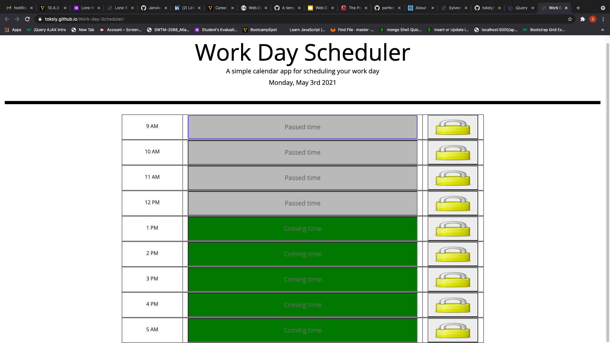

# Work-day-Scheduler

## Description

This application allows the user to be able  to add important events to his or her daily planner. it is designed to help the user save events for each working hour of the day, from 9am to 5pm. 

## Table of Contents

- [Website](#website)
- [Built with](#built-with)
- [Usage](#usage)
- [Contributors](#contributors)
- [Acknowledgements](#acknowledgements)

---

## Website

https://toksly.github.io/Work-day-Scheduler/

---

## Built with

- Javascript
- HTML
- CSS

[Back to Table of Contents](#table-of-contents)

---

## Usage

 This application allows the user to use a daily planner to create a schedule. The application displays current day at the top of the calender when it is opened. When scrolled down, it displays timeblocks, and each of these time blocks are color coded thereby helping user know wheather it is in the past,present or in the future. Clicking on a timeblock allows the user to be able to enter an event, while clicking on the save button (padlock image) for that timeblock saves any text for that event in the local staorage.

[Back to Table of contrents](#table-of-contents)

---

## Contributors

---
---

Sylvester Nwizu

---
---

[Back to Table of Contents](#table-of-contents)

---

## Acknowledgements

- [jQuery](https://jquery.com/)
- [moment.js](https://momentjs.com/)
- [bootstrap](https://stackpath.bootstrapcdn.com/)

---

[Back to table of Contents](#table-of-contents)

